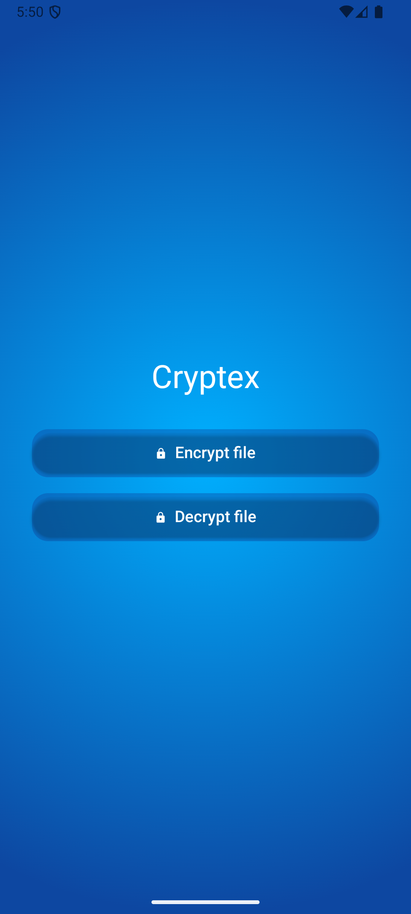

# Cryptex 🔐

**File Encryption & Decryption – Android App**

Cryptex is a secure mobile application designed to protect sensitive files. Built with Kotlin and
Jetpack Compose, it allows users to easily encrypt and decrypt files directly on their Android
devices, ensuring privacy and control over personal data.

All encrypted files are stored in the directory -> Documents/Cryptex

-----

#### DEMO



-----

## 🚀 Features

- 🔒 **Encrypt Files** Secure any file on your device with strong encryption algorithms.
- 🔓 **Decrypt Files** Restore original files quickly and safely.
- ⚡ **Modern UI** Built with Jetpack Compose for a sleek, responsive, and fluid user experience.

-----

## 🛠️ Tech Stack

- **Kotlin** (primary language)
- **Jetpack Compose** for UI
- **Hilt** for dependency injection
- **Clean Architecture** with modularization
- **Datastore** for data persistence
- **StateFlow** for reactive state handling

-----

## 📦 Installation

To build the project locally:

```bash
git clone https://github.com/AdrianLeyva/cryptex.git
cd cryptex
./gradlew assembleDebug
